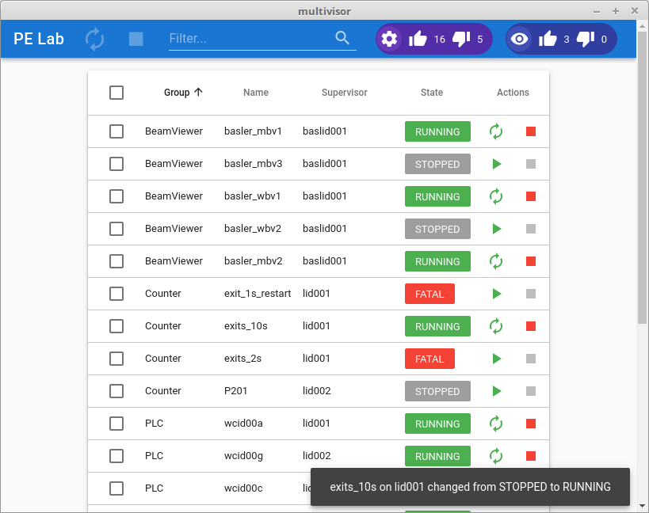
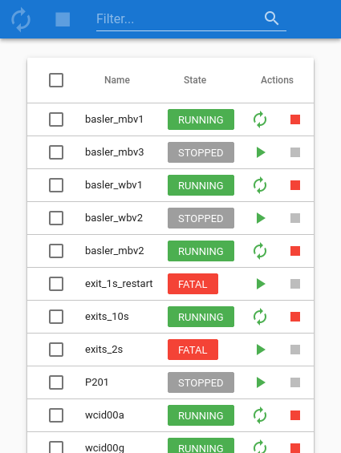

# Multivisor

A centralized supervisor web UI inspired by [cesi](https://github.com/gamegos/cesi).

* Processes status always up to date
* Reactivity through asynchronous actions
* Notifications when state changes
* Have a Single Page App
* Mobile aware
* Powerful filter to quickly see relevant processes

## Running the example from scratch

```bash
# Fetch the project:
git clone git://github.com/tiagocoutinho/multivisor
cd multivisor


# Install frontend dependencies
npm install
# Build for production with minification
npm run build

# install backend: feel free to use your favorite python virtual environment
# here. Otherwise you will need administrative privileges
pip install .

# Launch a few supervisors
supervisord -c examples/full_example/supervisord_lid001.conf
supervisord -c examples/full_example/supervisord_lid002.conf
supervisord -c examples/full_example/supervisord_baslid001.conf

# Finally, launch multivisor:
multivisor -c examples/full_example/multivisor.conf
```

That's it! Start a browser pointing to [localhost:22000](http://localhost:22000) and
you should be able to see something that looks like this:

Multivisor running on google chrome desktop:



Multivisor running on a mobile:




## Technologies

The backend runs a [flask](http://flask.pocoo.org/) web server.

The frontend is based on [vue](https://vuejs.org/) +
[vuex](https://vuex.vuejs.org/) + [vuetify](https://vuetifyjs.com/).


## Configuration

Make sure multivisor is installed on the host you are running supervisor. Then,
configure your supervisor(s) to send events to multivisor-rpc by adding the
following lines to your supervisord.conf:

```
[eventlistener:multivisor-rpc]
command=multivisor-rpc --bind=tcp://*:9002
events=EVENT
```

The name of the eventlistener is yours to choose (here we choose
*multivisor-rpc*).

Repeat the above procedure for every supervisor you have running.

The `multivisor` web server relies on the `multivisor-rpc` event listener of
each supervisor for both RPC and events.

The multivisor web server is configured with a INI like configuration file
(much like supervisor itself). It is usually named *multivisor.conf* and it
must be passed as argument to multivisor when starting the server.

It consists of a `global` section where you can give an optional name to your
multivisor instance (default is *multivisor*. This name will appear on the top
left corner of multivisor the web page).

To add a new supervisor to the list of supervisors monitored by multivisor
simply add a section `[supervisor:<name>]`.
It accepts an optional `url` in the format `[<host>][:<port>]`. The default
is `<name>:9002`.

Here is a basic example:

```
[global]
name=ACME

[supervisor:roadrunner]
# since no url is given it will be roadrunner:9002

[supervisor:coyote]
# no host is given: defaults to coyote
url=:9011

[supervisor:bugsbunny]
# no port is given: defaults to 9002
url=bugsbunny.acme.org

[supervisor:daffyduck]
url=daffyduck.acme.org:9007
```

## Build & Install

```bash

# install frontend
npm install

# build for production with minification
npm run build

# install backend
pip install .

```

## Run

```bash
# serve at localhost:22000
multivisor -c multivisor.conf
```

Start a browser pointing to [localhost:22000](http://localhost:22000)

## Development mode

You can run the backend using the webpack dev server to facilitate your
development cycle:

First, start multivisor (which listens on 22000 by default):

```bash
python -m multivisor.server -c multivisor.conf
```

Now, in another console, run the webpack dev server (it will
transfer the requests between the browser and multivisor):

``` bash
npm run dev
```

That's it. If you modify `App.vue` for example, you should see the changes
directly on your browser.
