# Multivisor


[](https://pypi.python.org/pypi/multivisor)
[](https://travis-ci.org/guy881/multivisor)

A centralized supervisor UI (Web & CLI)

* Processes status always up to date
* Reactivity through asynchronous actions
* Notifications when state changes
* Mobile aware, SPA web page
* Powerful filters
* Interactive CLI
* works on [supervisor](https://pypi.org/project/supervisor/)
  and [supervisor-win](https://pypi.org/project/supervisor-win/)

Multivisor is comprised of 3 components:

1. **web server**: gathers information from all supervisors and provides a
   dashboard like UI to the entire system
1. **multivisor RPC**: an RPC extension to supervisor used to communicate
   between each supervisord and multivisor web server
1. **CLI**: an optional CLI which communicates with multivisor web server

## Installation and configuration

The installation and configuration steps are exactly the same on Linux and
Windows.

Thanks to the [ESRF](https://esrf.eu) sponsorship, multivisor is able to work well with [supervisor-win](https://pypi.org/project/supervisor-win/).

### RPC

The multivisor RPC must be installed in the same environment(s) as your
supervisord instances. It can be installed on python environments ranging from
2.7 to 3.x.

From within the same python environment as your supervisord process, type:

```bash
pip install multivisor[rpc]
```

Configure the multivisor rpc interface by adding the following lines
to your *supervisord.conf*:

```toml
[rpcinterface:multivisor]
supervisor.rpcinterface_factory = multivisor.rpc:make_rpc_interface
bind=*:9002
```

If no *bind* is given, it defaults to `*:9002`.

Repeat the above procedure for every supervisor you have running.

### Web server

The multivisor webserver requires a python 3.x environment. It must be
installed on a machine with a network access to the different supervisors.
This is achieved with:

```bash
pip install multivisor[web]
```

The web server is configured with a INI like configuration file
(much like supervisor itself) that is passed as command line argument.
It is usually named *multivisor.conf* but can be any filename you which.

The file consists of a `global` section where you can give an optional name to
your multivisor instance (default is *multivisor*. This name will appear on the
top left corner of multivisor the web page).

To add a new supervisor to the list simply add a section `[supervisor:<name>]`.
It accepts an optional `url` in the format `[<host>][:<port>]`. The default
is `<name>:9002`.

Here is an example:

```toml
[global]
name=ACME

[supervisor:roadrunner]
# since no url is given it will be roadrunner:9002

[supervisor:coyote]
# no host is given: defaults to coyote
url=:9011

[supervisor:bugsbunny]
# no port is given: defaults to 9002
url=bugsbunny.acme.org

[supervisor:daffyduck]
url=daffyduck.acme.org:9007
```


Once installed and configured, the web server can be started from the command
line with:

```bash
multivisor -c ./multivisor.conf
```

Start a browser pointing to [localhost:22000](http://localhost:22000).
On a mobile device it should look something like the figure on the right.

Of course the multivisor web server itself can be configured in supervisor as a
normal program.

#### Authentication

To protect multivisor from unwanted access, you can enable authentication.

Specify `username` and `password` parameters in `global` section of your configuration file e.g.:

```toml
[global]
username=test
password=test
```

You can also specify `password` as SHA-1 hash in hex, with `{SHA}` prefix: e.g.
`{SHA}a94a8fe5ccb19ba61c4c0873d391e987982fbbd3` (example hash is `test` in SHA-1).

In order to use authentication, you also need to set `MULTIVISOR_SECRET_KEY` environmental variable,
as flask sessions module needs some secret value to create secure session.
You can generate some random hash easily using python:
`python -c 'import os; import binascii; print(binascii.hexlify(os.urandom(32)))'`

### CLI

The multivisor CLI is an optional component which can be installed with:

```bash
pip install multivisor[cli]
```

The CLI connects directly to the web server using an HTTP REST API.
It doesn't require any configuration.

It can be started with:

```bash
multivisor-cli --url localhost:22000
```



# Running the example from scratch

```bash
# Fetch the project:
git clone https://github.com/tiagocoutinho/multivisor
cd multivisor


# Install frontend dependencies
npm install
# Build for production with minification
npm run build

# feel free to use your favorite python virtual environment
# here. Otherwise you will need administrative privileges
pip install .[all]

# Launch a few supervisors
mkdir examples/full_example/log
supervisord -c examples/full_example/supervisord_lid001.conf
supervisord -c examples/full_example/supervisord_lid002.conf
supervisord -c examples/full_example/supervisord_baslid001.conf

# Finally, launch multivisor:
multivisor -c examples/full_example/multivisor.conf
```

That's it!

Start a browser pointing to [localhost:22000](http://localhost:22000). On a mobile
device it should look something like this:


# Technologies


The `multivisor` backend runs a [flask](http://flask.pocoo.org/) web server.

The `multivisor-cli` runs a
[prompt-toolkit](http://python-prompt-toolkit.rtfd.io) based console.

The frontend is based on [vue](https://vuejs.org/) +
[vuex](https://vuex.vuejs.org/) + [vuetify](https://vuetifyjs.com/).

# Development

## Build & Install

```bash

# install frontend
npm install

# build for production with minification
npm run build

# install backend
pip install -e .

```

## Run

```bash
# serve at localhost:22000
multivisor -c multivisor.conf
```

Start a browser pointing to [localhost:22000](http://localhost:22000)

## Development mode

You can run the backend using the webpack dev server to facilitate your
development cycle:

First, start multivisor (which listens on 22000 by default):

```bash
python -m multivisor.server.web -c multivisor.conf
```

Now, in another console, run the webpack dev server (it will
transfer the requests between the browser and multivisor):

``` bash
npm run dev
```

That's it. If you modify `App.vue` for example, you should see the changes
directly on your browser.
