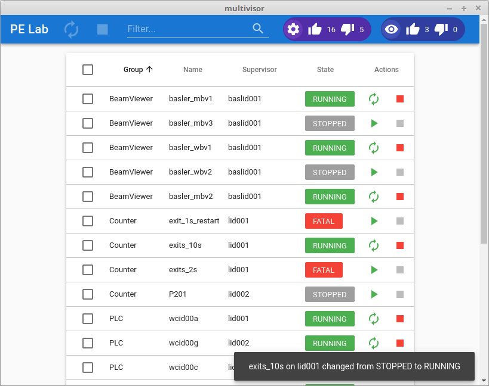
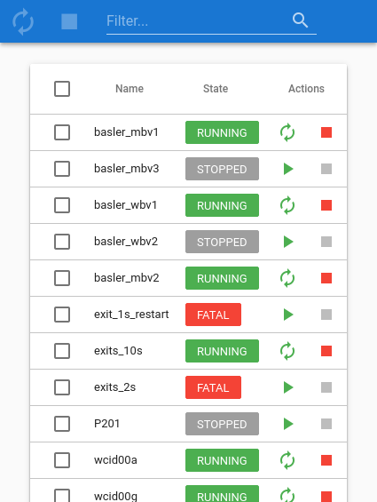
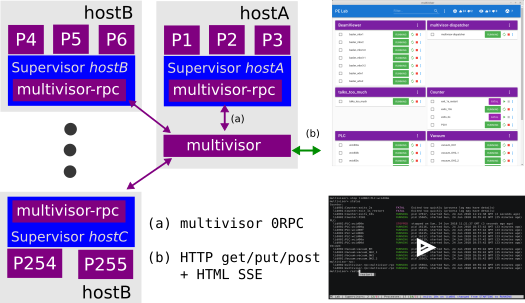

# Multivisor




[![Multivisor][pypi-version]](https://pypi.python.org/pypi/multivisor)
[![Python Versions][pypi-python-versions]](https://pypi.python.org/pypi/multivisor)
[![Pypi status][pypi-status]](https://pypi.python.org/pypi/multivisor)
![License][license]
[![Build Status][build]](https://github.com/tiagocoutinho/multivisor/actions/workflows/ci.yml)

A centralized supervisor UI (Web & CLI)

* Processes status always up to date
* Reactivity through asynchronous actions
* Notifications when state changes
* Mobile aware, SPA web page
* Powerful filters
* Interactive CLI
* works on [supervisor](https://pypi.org/project/supervisor/)
  and [supervisor-win](https://pypi.org/project/supervisor-win/)

Multivisor is comprised of 3 components:

1. **web server**: gathers information from all supervisors and provides a
   dashboard like UI to the entire system
1. **multivisor RPC**: an RPC extension to supervisor used to communicate
   between each supervisord and multivisor web server
1. **CLI**: an optional CLI which communicates with multivisor web server

## Installation and configuration

The installation and configuration steps are exactly the same on Linux and
Windows.

Thanks to the [ESRF](https://esrf.eu) sponsorship, multivisor is able to work
well with [supervisor-win](https://pypi.org/project/supervisor-win/).

### RPC

The multivisor RPC must be installed in the same environment(s) as your
supervisord instances. It can be installed on python environments ranging from
2.7 to 3.x.

From within the same python environment as your supervisord process, type:

```bash
pip install multivisor[rpc]
```

There are two options to configure multivisor RPC: 1) as an extra
[rpcinterface](http://supervisord.org/configuration.html#rpcinterface-x-section-settings)
to supervisord or 2) an [eventlistener](http://supervisord.org/configuration.html#eventlistener-x-section-settings) process managed by supervisord.

The first option has the advantage of not requiring an extra process but it's
implementation relies on internal supervisord details. Therefore, the multivisor
author recommends using the 2nd approach.

#### Option 1: rpcinterface

Configure the multivisor rpc interface by adding the following lines
to your *supervisord.conf*:

```ini
[rpcinterface:multivisor]
supervisor.rpcinterface_factory = multivisor.rpc:make_rpc_interface
bind=*:9002
multivisor_keys=<some_secret_key>
```
Parameters:
* `bind` - address and port on which multivisor rpc interface will listen to multivisor server connections, 
it defaults to `*:9002`.
* `multivisor_keys` - comma-separated list of secret keys (much like `authorized_keys` in SSH) which will restrict 
access to multivisor servers which have this key provided in supervisor section config. More about this in 
security section.

Repeat the above procedure for every supervisor you have running.

#### Option 2: eventlistener

Configure the multivisor rpc interface by adding the following lines
to your *supervisord.conf*:

```ini
[eventlistener:multivisor-rpc]
command=multivisor-rpc --bind 0:9002
events=PROCESS_STATE,SUPERVISOR_STATE_CHANGE
```

If no *bind* is given, it defaults to `*:9002`.

To restrict access to multivisor servers holding a secret key, pass a
comma-separated list of keys with `--keys` or, to keep them out of the process
list, with the `MULTIVISOR_KEYS` environment variable (more about this in the
[security](#security) section):

```ini
[eventlistener:multivisor-rpc]
command=multivisor-rpc --bind 0:9002
events=PROCESS_STATE,SUPERVISOR_STATE_CHANGE
environment=MULTIVISOR_KEYS="<some_secret_key>"
```

You are free to choose the event listener name. As a convention we propose
`multivisor-rpc`.

NB: Make sure that `multivisor-rpc` command is accessible or provide full PATH.

Repeat the above procedure for every supervisor you have running.


### Web server

The multivisor web server requires a python 3.x environment. It must be
installed on a machine with a network access to the different supervisors.
This is achieved with:

```bash
pip install multivisor[web]
```

The web server is configured with a INI like configuration file
(much like supervisor itself) that is passed as command line argument.
It is usually named *multivisor.conf* but can be any filename you which.

The file consists of a `global` section where you can give an optional name to
your multivisor instance (default is *multivisor*. This name will appear on the
top left corner of multivisor the web page).

To add a new supervisor to the list simply add a section `[supervisor:<name>]`.
It accepts an optional `url` in the format `[<host>][:<port>]`. The default
is `<name>:9002`.

Here is an example:

```ini
[global]
name=ACME

[supervisor:roadrunner]
# since no url is given it will be roadrunner:9002

[supervisor:coyote]
# no host is given: defaults to coyote
url=:9011

[supervisor:bugsbunny]
# no port is given: defaults to 9002
url=bugsbunny.acme.org

[supervisor:daffyduck]
url=daffyduck.acme.org:9007

[supervisor:secured]
url=:9002
# same as multivisor secret key provided in rpc_interface config
multivisor_key=<some_secret_key>
```



Once installed and configured, the web server can be started from the command
line with:

```bash
multivisor -c ./multivisor.conf
```

Start a browser pointing to [localhost:22000](http://localhost:22000).
On a mobile device it should look something like the figure on the right.

Of course the multivisor web server itself can be configured in supervisor as a
normal program.

#### Authentication

To protect multivisor from unwanted access, you can enable authentication.

Specify `username` and `password` parameters in `global` section of your configuration file e.g.:

```ini
[global]
username=test
password=test
```

You can also specify `password` as SHA-1 hash in hex, with `{SHA}` prefix: e.g.
`{SHA}a94a8fe5ccb19ba61c4c0873d391e987982fbbd3` (example hash is `test` in SHA-1).

In order to use authentication, you also need to set `MULTIVISOR_SECRET_KEY` environmental variable,
as flask sessions module needs some secret value to create secure session.
You can generate some random hash easily using included script: `generate_secret_key.py`.

**Warning**: this authentication on its own doesn't protect your supervisors rpc interface
from other multivisor connecting to it, read more about this in the [security](#security) section.

### CLI

The multivisor CLI is an optional component which can be installed with:

```bash
pip install multivisor[cli]
```

The CLI connects directly to the web server using an HTTP REST API.
It doesn't require any configuration.

It can be started with:

```bash
multivisor-cli --url localhost:22000
```


# Running the docker demo

```bash
$ docker-compose build --parallel
$ docker-compose up
```

That's it!

Start a browser pointing to [localhost:22000](http://localhost:22000).

# Running the example from scratch

```bash
# Fetch the project:
git clone https://github.com/tiagocoutinho/multivisor
cd multivisor


# Install frontend dependencies
npm install
# Build for production with minification
npm run build

# feel free to use your favorite python virtual environment
# here. Otherwise you will need administrative privileges
pip install .[all]

# Launch a few supervisors
mkdir examples/full_example/log
supervisord -c examples/full_example/supervisord_lid001.conf
supervisord -c examples/full_example/supervisord_lid002.conf
supervisord -c examples/full_example/supervisord_baslid001.conf

# Finally, launch multivisor:
multivisor -c examples/full_example/multivisor.conf
```

That's it!

Start a browser pointing to [localhost:22000](http://localhost:22000). On a mobile
device it should look something like this:


# Technologies



The `multivisor` backend runs a [flask](http://flask.pocoo.org/) web server.

The `multivisor-cli` runs a
[prompt-toolkit](http://python-prompt-toolkit.rtfd.io) based console.

The frontend is based on [vue](https://vuejs.org/) +
[pinia](https://pinia.vuejs.org/) + [vuetify](https://vuetifyjs.com/).

# Development

See [CONTRIBUTING.md](CONTRIBUTING.md).


# Security
The project uses [zerorpc library](https://github.com/0rpc/zerorpc-python/) to invoke commands on supervisors instances.
That's why it is required to specify custom rpc interface in supervisor config. However, zerorpc should be used only in 
private networks, as it doesn't come with any kind of authentication. So you can add a supervisor to your multivisor
instance if you know IP and port of exposed multivisor RPC interface and control processes on another machine. That 
can be a security issue if those ports are open on the server.

To address this issue, the project uses a special header with the signature of the send message, generated using 
security key provided in both supervisor and multivisor config. The secret key can be generated using the script 
`generate_secret_key.py`.

See example configuration below.

**supervisor** (rpcinterface):
```ini
[rpcinterface:multivisor]
supervisor.rpcinterface_factory = multivisor.rpc:make_rpc_interface
multivisor_keys=<some_secret_key>,<another_secret_key>
```

**supervisor** (eventlistener):
```ini
[eventlistener:multivisor-rpc]
command=multivisor-rpc --bind 0:9002
events=PROCESS_STATE,SUPERVISOR_STATE_CHANGE
environment=MULTIVISOR_KEYS="<some_secret_key>,<another_secret_key>"
```

**multivisor**:
```ini
[supervisor:lid001]
url=localhost:9012
multivisor_key=<some_secret_key>
```

In above example only multivisors which provided `multivisor_key` as `<some_secret_key>` or `<another_secret_key>` can
connect to the specified supervisor.


[pypi-python-versions]: https://img.shields.io/pypi/pyversions/multivisor.svg
[pypi-version]: https://img.shields.io/pypi/v/multivisor.svg
[pypi-status]: https://img.shields.io/pypi/status/multivisor.svg
[license]: https://img.shields.io/pypi/l/multivisor.svg
[build]: https://github.com/tiagocoutinho/multivisor/actions/workflows/ci.yml/badge.svg?branch=develop
